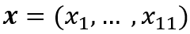

# StampRally_GA

## 作品名
遺伝的アルゴリズム(GA)を用いて最短時間の経路探索プログラム．

結果表示：
最良個体 at oo世代 : 個体番号 (全乗車時間：oo) [1,2,...ルート順]

## 概要
このプログラムは，西武線で行われた「映画ドラえもん のび太の新恐竜」公開記念　西武線アプリスタンプラリー」を最短時間で回るルート検索を行った．

URL：https://www.seiburailway.jp/guide/event-campaign-info/event/doraemon2020/index.html

全11駅の表現は，以下のような数字で表現している．

0. 武蔵藤沢(スタート駅かつゴール駅)
1. 入間市
2. 所沢
3. 石神井公園
4. 練馬
5. 池袋
6. 豊島園
7. 新所沢
8. 田無
9. 鶯ノ宮
10. 高田馬場
11. 西武新宿

## 遺伝的アルゴリズム
遺伝的アルゴリズムは，

1. 個体評価
2. 交叉
3. 突然変異

を繰り返すことによって個体集団を進化させるアルゴリズムである．

本プログラムでは，交叉に一様順序交叉，突然変異に2点交換を使用している．

問題の定式化として，

- 設計変数：

...各次元は上記の駅番号表記と対応し，値としてルートの順序を持つ．
- 目的関数：

N...スタンプ取得数
- 制約条件：訪れる駅は重複しないこと．

プログラムの構成

1. 初期個体集団をランダムに生成．
2. 交叉の適応
3. 突然変異の適応
4. 個体集団の評価
5. 次世代に残す個体の選択
6. 2~5の操作を最大世代数に達するまで繰り返す

## 環境
- ファイル構造
  - timetable
    - 出発時間を記録したファイル集合
  - time_riding
    - 各駅，急行などの場合の乗車時間を記録したファイル集合
  - stamp.py
  
- 実行環境
  - Python 3.8
  - import random
  - import copy
  - import openpyxl

## 注意事項
- 本プログラムは，スタート地点とゴール地点を「武蔵藤沢」に固定している．
  - スタートとゴールの変更を行う際は，プログラムのスタート(0)変更と時刻表の追加を行う必要がある．
- 本プログラムはスタートを9:30に設定している．
  - スタート時間はstamp.pyのdef evaluateにおいて変更できる．
- 本プログラムは厳密な下車時刻を使用せずに，電車の出発時間と乗車駅から目的の下車駅までの平均乗車時間により，トータル所要時間を予測している．そのため，実際の時間と若干の誤差が確認されている．
  - N=5のとき誤差およそ11分，N増加により誤差蓄積される．時刻表のデータ作成の渡し方を大きく変更する必要がある．
- 初期個体によっては最良個体に収束しないことがある．
  - 突然変異や交叉の改善を行うことで改善が見られると考える．

